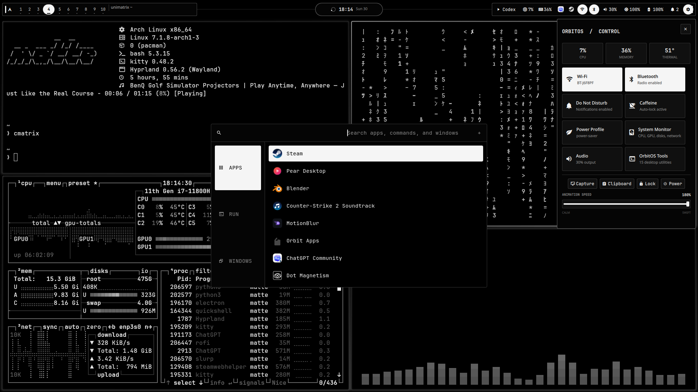
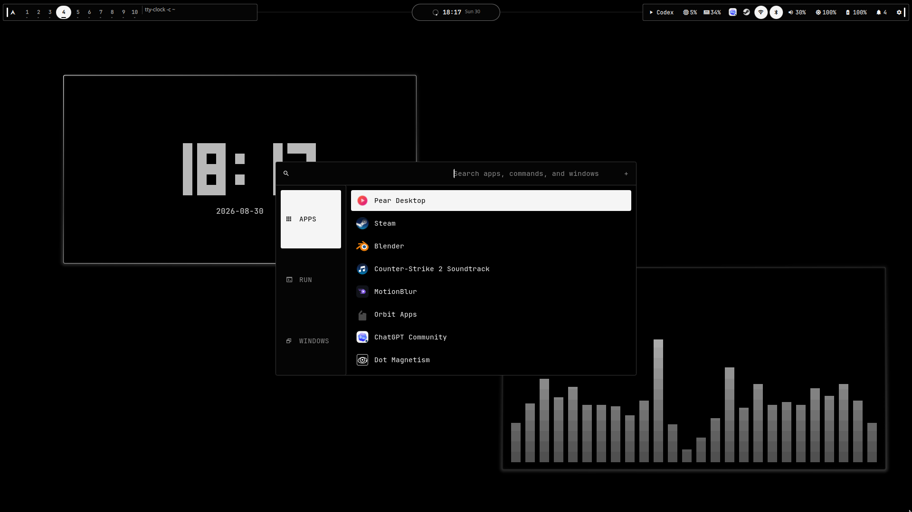

# OrbitOS

A UX-first monochrome Hyprland desktop for Arch Linux. UI follows function:
fast access, clear feedback, small corners, and motion you can tune.


## Screenshots




Includes a Quickshell bar and home screen, control and time hubs, alarms,
an installed-app manager, styled Rofi and wlogout, plus native OrbitOS apps.

The ecosystem includes Orbit Launcher, a live-telemetry Game Accelerator with
reversible Boost sessions, and a unified Settings app for displays, input,
sound, motion, windows, connectivity, power, and system tools.

Click the Arch icon to go home. Click the clock for calendar, alarms, and timers.
Use `Super+Esc` for Home, `Super+I` for Settings, `Super+O` for Orbit Launcher,
and `Super+G` for Game Accelerator.

## Install

On Arch Linux, run:

```bash
git clone https://github.com/dsksnkz/OrbitOS.git && cd OrbitOS && ./install.sh
```

The installer can install the Arch packages and AUR integrations used by
OrbitOS, create a timestamped backup, deploy the dotfiles, enable networking
and Bluetooth, and adapt user-specific paths. Your monitor layout is preserved
unless you explicitly choose the included layout.

Use `./install.sh --yes` to accept the recommended installer choices. Run
`./install.sh --dry-run` to preview the actions or `./install.sh --no-packages`
to deploy only the dotfiles. Backups are stored in
`~/.local/state/orbitos/backups/`.

Made for Arch Linux, Hyprland, and Wayland. Review the files before installing.
