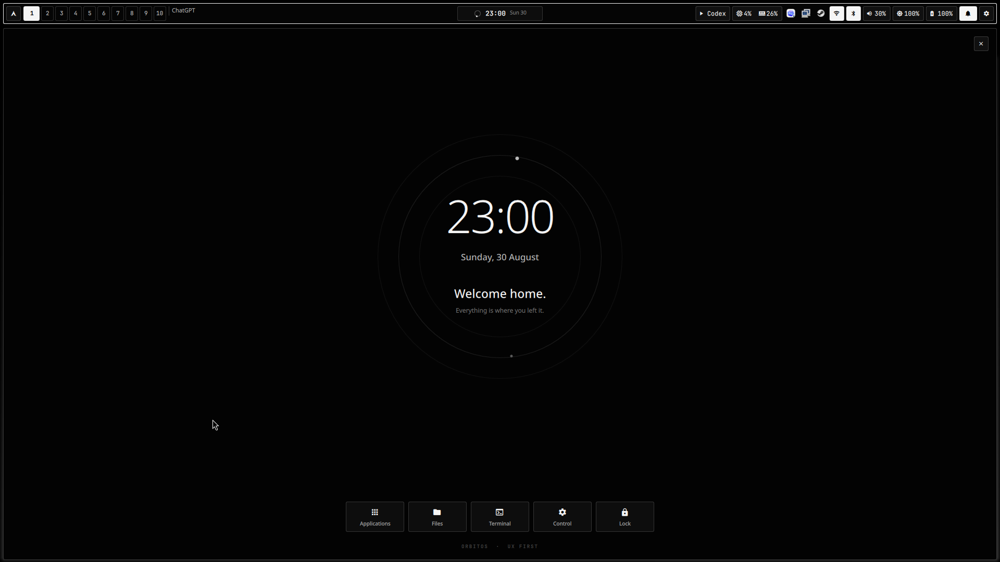

# OrbitOS

A UX-first monochrome Hyprland desktop for Arch Linux. UI follows function:
fast access, clear feedback, small corners, and motion you can tune.



Includes a Quickshell bar and home screen, control and time hubs, alarms,
styled Rofi and wlogout, plus matching app themes.

Click the Arch icon to go home. Click the clock for calendar, alarms, and timers.

## Install

```bash
git clone https://github.com/dsksnkz/OrbitOS.git
cd OrbitOS
chmod +x install.sh
./install.sh
```

The installer offers to back up your existing dotfiles and asks separately
before applying the included monitor layout.

Made for Arch Linux, Hyprland, and Wayland. Review the files before installing.
